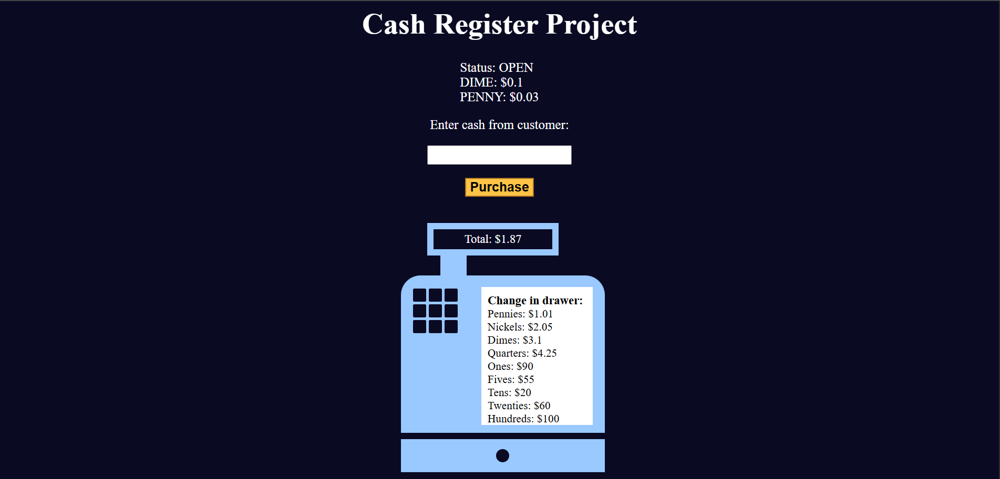

# **Cash Register App**  
A simple and interactive cash register application that calculates and returns change based on the item's price, the customer's payment, and the available cash in the drawer.

**Link to project:** [Cash Register App](https://ayushsaxena0.github.io/cash-register/) 

**Screenshot:** 
**Alt tag:** Screenshot of Cash Register web app UI

---

## **How It's Made:**  
**Tech used:** HTML, CSS, JavaScript

This cash register app takes an item's price and a customer's cash input, compares it to the available cash in the drawer (stored as a 2D array), and returns change accordingly. The app intelligently determines the correct change using the highest denominations available and provides different status messages based on the drawer's condition. Key logic includes:

- Validating if the user has entered enough cash  
- Calculating the precise change to be returned  
- Displaying the drawer status: `OPEN`, `CLOSED`, or `INSUFFICIENT_FUNDS`  
- Dynamically updating the UI with results and drawer values  

---

## **Optimizations**  
To keep calculations accurate and avoid floating-point issues, all currency operations are rounded to two decimal places. Also, the DOM updates are structured to reflect real-time drawer status and change details, improving the interactivity and usability of the app.

---

## **Lessons Learned:**  
While building this, I learned a lot about:
- Handling floating-point precision in JavaScript  
- Mapping between data structures and UI  
- DOM manipulation based on form input  
- Structuring logic for real-world use cases like cash transactions  

This project really helped me understand conditional rendering and how to break down complex decision-making logic into manageable chunks.
